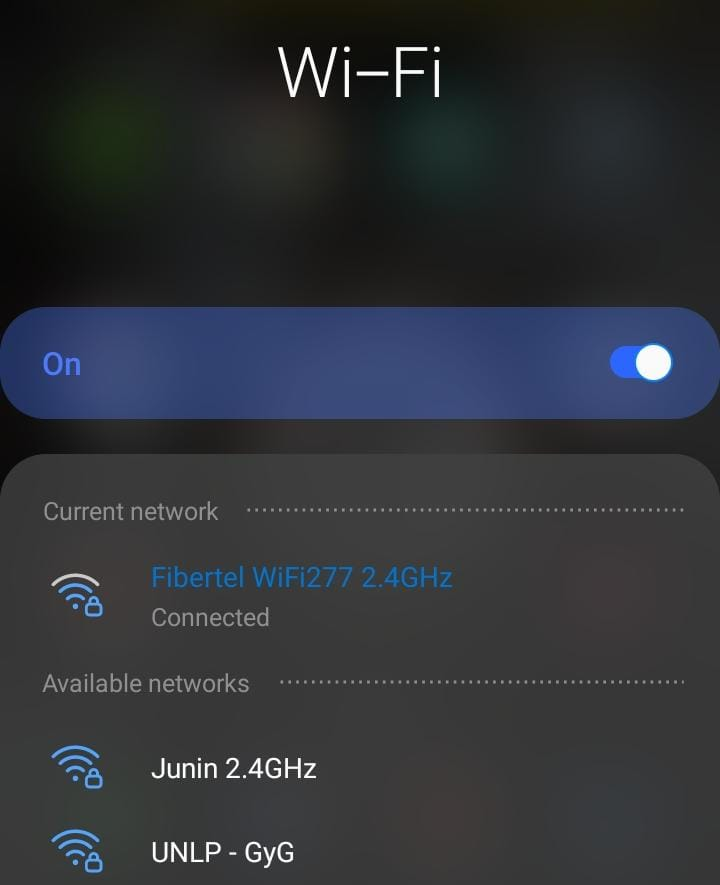
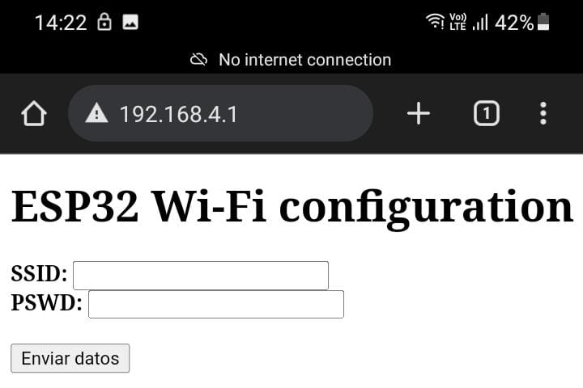

# Resume
This project consist in generate a webserver with an ESP32 to provide the SSID and password of the network that is intended to use.

This is done by connecting with any device such a smartphone, laptop, etc, to the Acces Point generated by the ESP. Once connected, in a navegator type: *192.168.4.1* (or the IP assigned to the ESP32 which es printed in console). This will automatically show the page bellow

  

Then fill the textbox with the WiFi network data and press "Enviar datos". After submit the data, the ESP32 will turn off the AP and will try to connect in STA mode with the data entered. It's important to know that the data is stored in ROM, so if the ESP32 suddenly turn off for some reason, when you energyze it again, it will try to connect with the last network after 2 minutes of innactivity.

## How to flash the program in MY computer??
It's well known that Espressif has many many *many* problems in their documentation and can cause an importants confussions if you are not familiarized with the environment. So that I decided to make a kind a recipe to run this program on your computer/esp32.

I'll assume that you already have installed the espressif extension for VSCode.

* Create a new project using the "Hello World!" template. 
* **Build the project!!**. This is because the first time you create a project, all files and tools (such as CMake and Ninja) need to be launched at least once to create the project.
* Now that you built the project, type "ctrl+shift+p" in VSCode to open the *Command Palette* and type: "Create new component" and create TWO components.
* The espressif tool will ask you for a name to the components, you MUST name it "WiFi" and "WebServer". I insist with MUST because all CMakeLists and libraries are hardcoded with that names.
* Then copy&paste the scripts of the news components. DON'T FORGET THE CMakeLists.txt.
* Finally, copy&past the main.c and CMakeLists.txt and build again.

If you followed that steps, you should be able to flash your ESP32 and generate the WebServer. The SSID of the network is *GyG* by default, and the password is: *defiunlp* also by default (note that **defiunlp** is "**D**epartamento de **E**lectrotecnia - **F**acultad de **I**ngeniera - **U**niversidad **N**acional de **L**a **P**lata") both parametters are macros defined in *WiFi.c*. Once you entered the data, the ESP32 will blink the built in blue LED indicating that everything is fine.

## What if my router lost connection for a minute or more?
If you lost connection no problem, the code is *robust* in that sense since if the connection is lost it will try to reconnect to the same network at least MAX_RETRY times (where MAX_RETRY is a macro defined at the top of the main) before the AP is seted again.

## What if I don't provide any data to the WebServer?
Well, you must provided it at least once. Otherwise garbage data will be loaded in ROM the first time you run the code.

In case that you already provided data to the webserver, if the ESP32 detects innactivity the first two minutes, it will try to connect to the last network (that's why important to load data at least once!!).

# TO DO:

- [x] Eliminar la mayor cantidad de variables globales posible.
- [x] Embeber archivo HTML en webserver para evitar codigo HTML dentro del código en C (WebServer.c) y modularizar el código. Al final del main.c aparece código de ejemplo copiado y pegado de la página oficial de espressif.
- [x] Simplificar y COMPLETAR el decodificar de URL.
- [x] Analizar una posible reducción en cantidad de handlers que tiene el loop event .
- [x] Limpiar main, modularizar código para facilitar lectura.
- [x] Modificar variable parametters por dentro del WebServer para evitar el loop infinito
- [x] Buscar la forma de que parametters NO sea una variable global dado que la usa WebServer para indicar que se apretó el botón de enviar datos.

