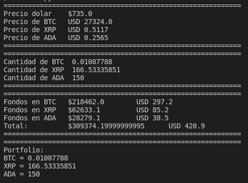

# Resumen / Resume
Este es un proyecto donde podrás saber el precio actual de cualquier criptomoneda presente en Google Finance, y su valor en pesos argentinos en función del valor actual del dolar blue.

-----------------

*This is a project where you'll be able to know the current price of any cryptocurrency present in Google Finance, and their values in argentinian pesos as function of dollar blue value*.

## ¿Cómo correr el código? / How to run the code?
* Primero, asegurate de tener instalado los modules requests y BeautifulSoup4.
* Segundo, debes seguir las instrucciones presentes en el archivo fondos.txt. Allí encontrarás una serie de instrucciones y cómo agregar la criptomoneda que quieras.
* Eso es todo, ahora solo debes correr ```$ python3 consulta.py ```.

------------------
* First, be sure that the modules requests and BeautifulSoup4 are installed.
* Second, you need to follow the instructions present in fondos.txt file. There you'll find a set of instructions and how to add the cripto that you want to know.
* That's it, now just run ```$ python3 consulta.py ```.

## Salida / Output
A continuación se muestra un ejemplo de la salida de la consola.

---------------------------------------
*The following image is an example of the output console*.

------------------------------
