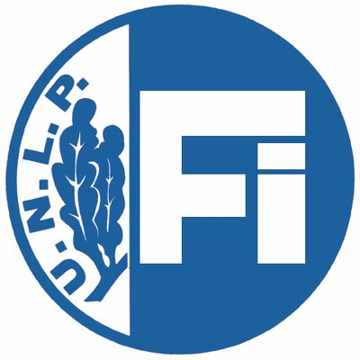
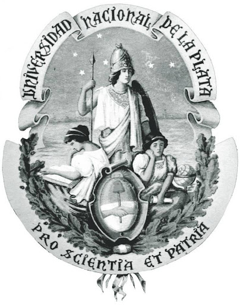

# Personal portfolio
Hi there! :wave: I'm Kevin Giribuela, electronic and telecommunications engineer.

You're currently watching my personal portfolio made exclusively to share projects and show my work with anyone :smile:.

## What you'll find in this repository? 

Here you can find differents projects made by me, a passionate guy in all about electronics, telecommunications and digital design means (as an Argentinian would said) very "culo inquieto".

Among all those projects, you'll find Python code, Verilog code, some projects that I made when I was student, etc...

## Who am I?
As I said before, I'm an electronic and telecommunications engineer, proudly graduated from Universidad Nacional de La Plata:books:.

My interests lays on digital design, digital signal processing, and telecommunications.

 
