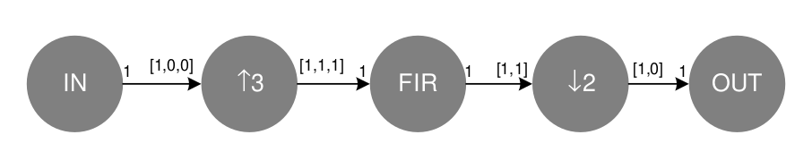

# From DFG to a Fully Dedicated Architechture
A digital up/down converter can be realized as a cyclo-static DFG. The production and consumption rate as vectors in the DFG given in the figure bellow implement a 3/2 digital up/down converter. Design the register and multiplexer to realize the design in HW.

--------------------

## Implementation 
First, we observe that the input to the system produce one token every cycle while the upsampling process just consume one token every three cycles but produces one token every cycle. So, a mux must be used to generate the dessired behavior. It's important note that the at the global clock rate while the mux must work three times faster to generate those three outputs.

Here the mux is driven by an external logic that select the input data and then select the GND data.

Then, the mux output is feeded to the FIR filter, which works a 3 times the global clock. After the FIR filter process the input samples, the outputs are sampled at 3/2 the global clock. This represent the downsampling by a factor of 2.

The FDA and the timing diagram are shown bellow:

### Another option
If the 3/2 factor applied to the global clock, you can think in another implementation, which is based on multiply by a factor of 2 to the overall clock and obtain integers factors of global clock, as shown bellow.

