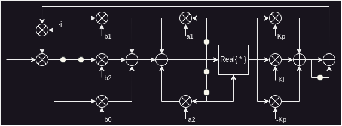
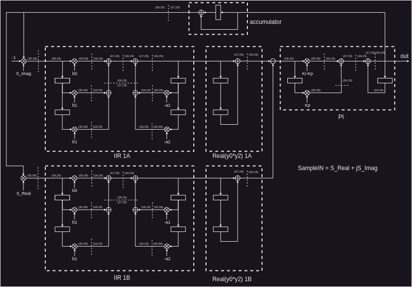

# Phase corrector
The code below lists one iteration of an algorithm implementing a block in a digital communications
receiver. The algorithm processes a complex input InputSample and gives it a phase correction.
The phase correction is computed in this code. Draw DFG, and map it on to an FDA. Write RTL
Verilog code of the design using 16-bit fixed point arithmetic. Write a stimulus to verify the RTL code.

```Mixer_out = InputSample*(-j*Phase);
// a number of algorithmic registers
Mixer_Out[2] = Mixer_Out[1];
Mixer_Out[1] = Mixer_Out[0];
Mixer_Out[0] = Mixer_out;
Delayline[2] = Delayline[1];
Delayline[1] = Delayline[0];
// feedback loop, where a and b are arrays of 16-bit constants
// Kp and Ki are also 16-bit constant numbers
Delayline[0]= - Delayline[1]*a[1]
- Delayline[2]*a[2]
+ Mixer_Out[0]*b[0]
+ Mixer_Out[1]*b[1]
+ Mixer_Out[2]*b[2];
offset = real(Delayline[2]*Delayline[0]);
offset_Delayline[0] = offset_Delayline[1];
offset_Delayline[1] = offset;
phase_corr = Kp*offset_Delayline[0]
+ Ki*offset_Delayline[1]
+ phase_corr
- Kp*offset_Delayline[1];
Phase = Phase + phase_corr; 
```

--------------------
# Solution
## Data Flow Graph (DFG)
Below is the DFG obtained from the code presented above.


Since this algorithm uses complex numbers, the design of the RTL must be split into two parts: one processing the real numbers, and the other processing the imaginary numbers.

A quick review of the DFG reveals that the algorithm is composed of:

* IIR filter.
* Real part operator.
* PI filter (IIR).

So, the design will focus on the correct implementation of each block and then the integration of them. Therefore, different tests have been developed and can be found in the "Desarrollo de test" folder.

## RTL

Below is the RTL design. It's possible to observe that the design is clearly split into two main blocks: a block that computes the real numbers and a block that computes the imaginary numbers. Then, subtraction is used to finish the real part operation. Finally, the result is fed to the PI filter, and the accumulator is updated.



