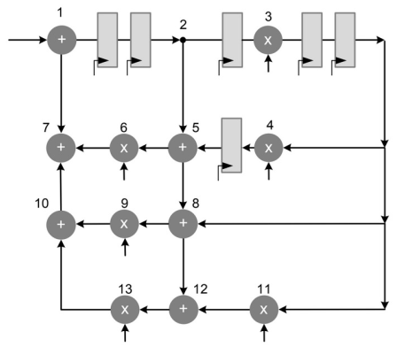
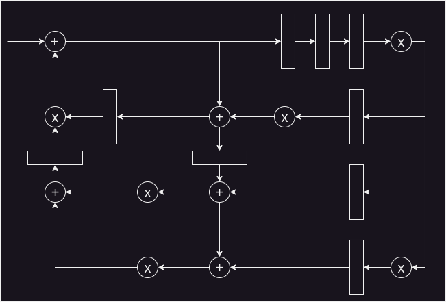

# IPB
For the following DFG assume that each operation is performed in 1 time unit

- 1 Identify all DFG loops.
- 2 Calculate the iteration period.
- 3 The relation loop.
- 4 The IBP.
- 5 The critical path.
- 6 It is possible to reduce the critical path to 3 time units just applying retiming only? If affirmative show the resulting architecture

# Solution
### Identifying all loops
L1: 1 -> 2 -> 5 -> 6 -> 7

L2: 1 -> 2 -> 5 -> 8 -> 9-> 10-> 7

L3: 1 -> 2 -> 5 -> 8 -> 12 -> 13 -> 10 -> 7

L4: 1 -> 2 -> 3 -> 4 -> 5 -> 6 -> 7

L5: 1 -> 2 -> 3 -> 8 -> 9 -> 10 -> 7

L6: 1 -> 2 -> 3 -> 11 -> 12 -> 13 -> 10 -> 7

### Calculating the iteration period
The RTL requires
* 6 multipliers.
* 3 adders.

Considering that each operation takes one temporal unit, the iteration period results in 6 time units.

### Relation loop
$$ 
\begin{align*}
L1:& \dfrac{3\ sum+ 1 \ mult}{2 \ registers} = 3/2 \\
L2:& \dfrac{5\ sum + 1\ mult}{2 \ registers} = 3\\
L3:& \dfrac{6\ sum + 1 \ mult}{2 \ registers} =3.5\\
L4:& \dfrac{3\ sum + 3\ mult}{6 \ registers} = 1\\
L5:& \dfrac{4\ sum + 2 \ mult}{5 \ registers} = 6/5\\
L6:& \dfrac{4 \ sum + 3 \ mult}{5 \ registers} = 7/5\\
\end{align*}
$$
### The IPB
Since the major relation loop was found with the L3 loop, the iteration period bound will be 3.5.

### The critical path
The critical path is formed by L3 loop since is where there is the longest path without a register breaking the data path.

### It is possible to reduce the critical path to 3 time units just applying retiming only?
Yes, it is possible. The resulting architecture post retiming is shown below

