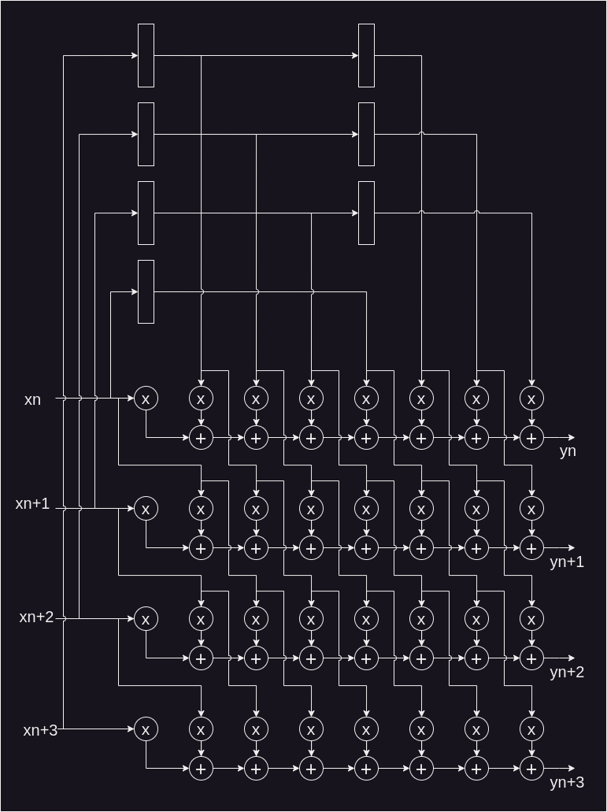
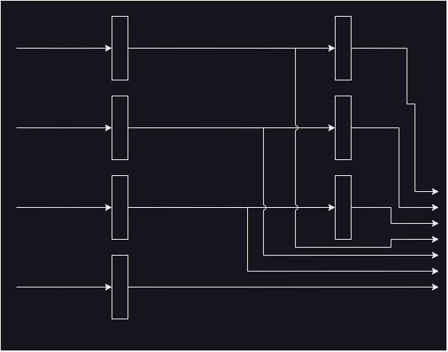
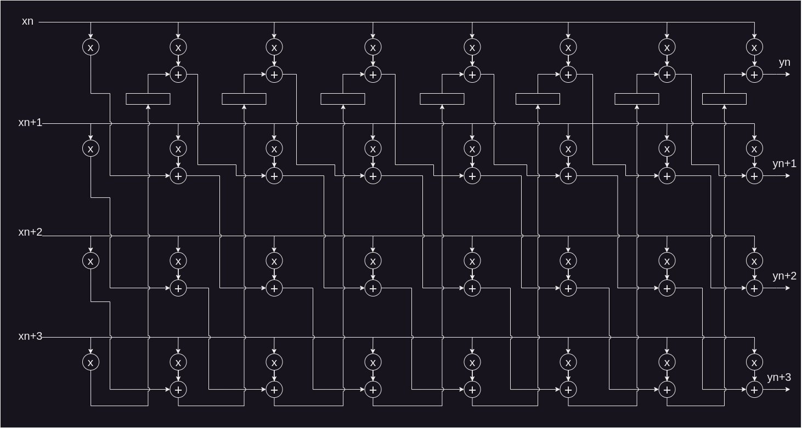
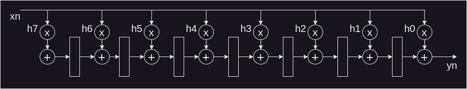
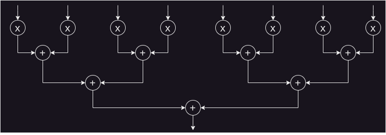
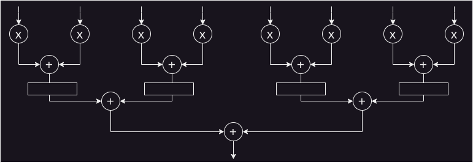
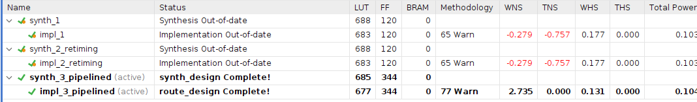
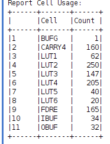

# Parallelism and unfolding
The objetive in this lab is compare complexity and timing between a direct FIR filter and a parallel TDF unfolding 4 filter.

So, we must:
* Design and implement a parallel FIR.
* Design and implement a TDF filter with unfolding factor 4.
* Design a testbench for both methods.
* Create a XDC file with a clock of 100MHz.
* Get the critical path and timing and usage report.

Also:
* Input/Output parallelism 4.
* Resolution **X** S(8,7), **h** (8,7), **Y** determined by designer.
* All filters use the same coefficients.

$$
\begin{align*}
h_0&=8'd0\\
h_1&=8'd229\\
h_2&=8'0d\\
h_3&=8'81d\\
h_4&=8'127d\\
h_5&=8'81d\\
h_6&=8'0d\\
h_7&=8'229d\\
\end{align*}
$$
# Solution
## Parallel direct FIR filter
The RTL for this filter is shown below

In the image above it's possible to observe the need of a regressor, which is shown as follow

So, this way, the paraller FIR filter with parallel factor 4 is design.

## TDF FIR filter with unfolding factor 4
Applying the unfolding technique we obtain the following RTL

which is based on their original design

# Timing and usage report
When the timing report was obtained, there was timing issues with the parallel FIR filter. Although the synthesis was re-launched with forced re-timing, the timing issues still remains. So, pipeline technique was applied as follow in the sum tree

Finally, the synthesis results with timing and usage reports are shown below

**Parallel FIR filter synthesis results**

**Parallel FIR filter report**

**TDF unfolded FIR filter report**

