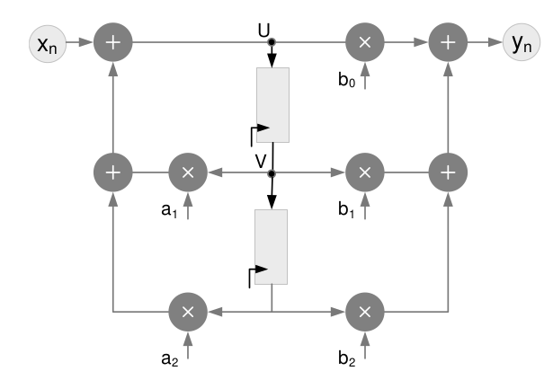
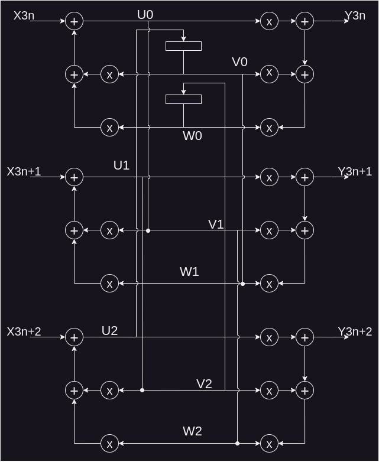
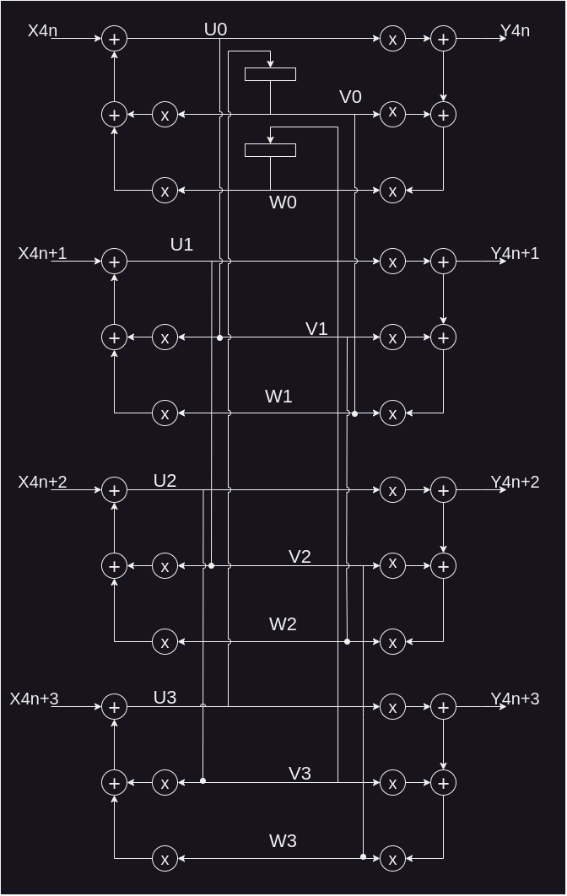

# Unfolding
Apply the unfolding technique to the second order IIR filter in TDF structure.

* By a factor of J=3.
* By a factor of J=4.
* Identify the loops on the structure and calculate their IPB assuming that multipliers takes 3 time units and adder takes 2 time units.

# Solution
## Unfolded factor 3

## Unfolded factor 4
