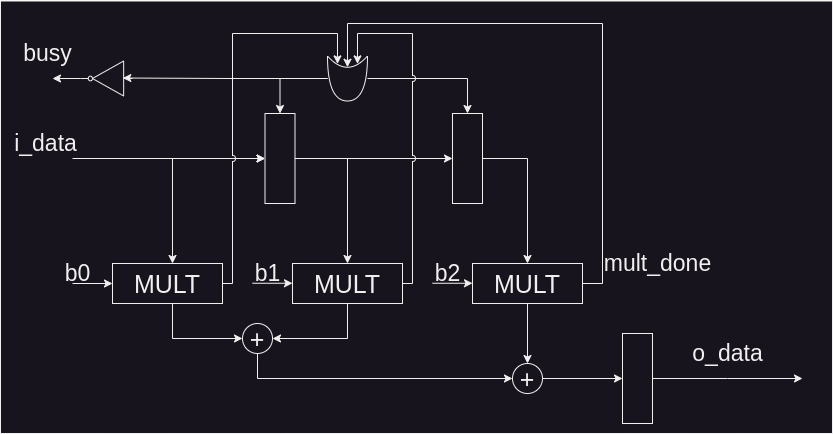

# Serial-Bit FIR Filter
Using the previously designed multiplier, create a FIR filter with 3 coefficients and perform testing.

# Solution
The RTL representation of the FIR filter is shown below:

It can be observed that the filter utilizes an additional signal called "busy." This signal is set to HIGH when the multipliers are not ready. Only when all multipliers are ready, "busy" is set to LOW, allowing new data to enter the system.

## Testing
The testbench can be found in the `test.ipynb` file.
