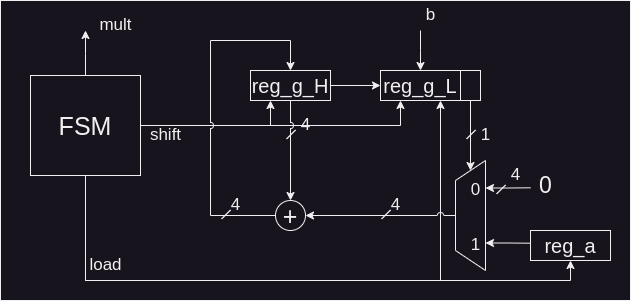
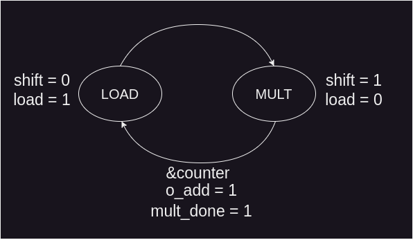
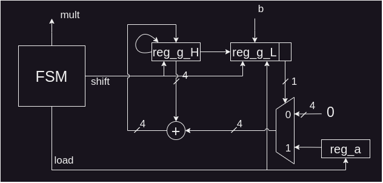

# Serial Multiplier
Design a serial unsigned 4x4-bit multiplier. Modify the multiplier to perform an operation with S(4,3) signed numbers. Truncate the result to S(4,3), ignoring the less significant bits.

# Solution
## Unsigned Multiplier
The RTL for the unsigned multiplier is shown below:

It can be observed that an FSM is needed. The FSM was designed as follows:

This multiplier presents the multiplication result after 4 cycles in its output.

## Signed Multiplier
The signed multiplier has almost the same RTL. The only difference is found in the right shift operation in the reg_g_H register, which now performs sign extension, as shown below:

